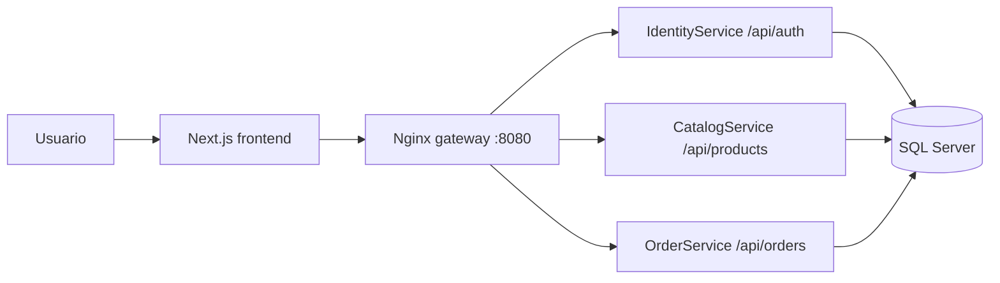

# Decisiones de arquitectura

El frontend se organiza por funcionalidades (`features`), no por tipo de archivo. Cada módulo conserva sus componentes, modelos y servicios, por lo que puede evolucionar sin acoplar la interfaz a detalles de infraestructura.

```text
src/app              rutas y composición de páginas (Next.js App Router)
src/features         casos de uso de la interfaz: auth, catálogo, carrito, checkout, pedidos
src/shared/api       infraestructura HTTP reutilizable
src/shared/audit     contrato de auditoría de escritura
src/components       componentes de composición transversal
```

## Diagrama de arquitectura



## Flujo clave

1. El usuario entra al catálogo desde el frontend.
2. El gateway enruta la solicitud al microservicio correspondiente.
3. Identity emite el JWT para autenticación.
4. Catalog expone productos e inventario.
5. Orders crea la orden y descuenta existencias.

## Contrato recomendado con Minimal APIs

La API debe validar identidad y autorización. El navegador no debe decidir precios, estados de pedido, autorización de pago ni acceso a eventos. Al confirmar un pedido, el backend debe crear la orden, registrar el evento de auditoría y devolver el número de pedido en una única operación de aplicación.

La consulta `GET /orders/{number}/status` puede ser pública pero debe devolver únicamente información mínima y requerir un identificador no predecible (por ejemplo, UUID o código de seguimiento). La bitácora sólo debe permitir `POST /events` para el cliente autenticado; su lectura queda reservada a un rol administrativo en la API.
